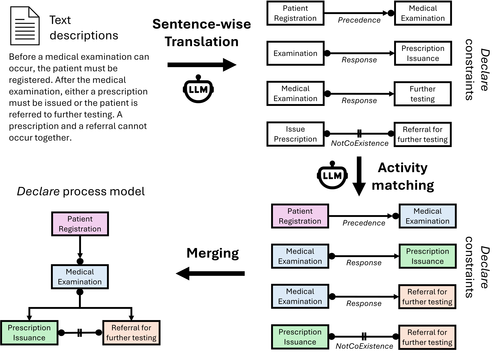

# Natural Language to Declare

This project supports the automated extraction of Declare constraints from natural language texts using fine-tuned Large Language Models (LLMs). Two main features are supported:
- Fine-tuning a user-provided LLM with gold standard Declare constraints
- Computing various metrics to evaluate the quality of extracted Declare constraints



## Quick Start

```bash
# Clone and set up the environment
git clone <repository-url>
cd nl2declare

# Create virtual environment and install dependencies
python -m venv venv
source venv/bin/activate  # On Windows: venv\Scripts\activate
pip install -r requirements.txt

# For internal validation with instruction-tuned models:
# pip install -r requirements-instruct.txt
```

## Requirements Files

- **`requirements.txt`**: General dependencies for base models (Gemma 7B, Mistral 7B, Llama-3 8B, etc.)
- **`requirements-instruct.txt`**: Specific dependency versions for instruction-tuned models (Llama-3.2-1B-Instruct, Llama-3.2-3B-Instruct) used in internal validation

# 1. Fine-Tuning a LLM 

The Jupyter Notebook file (`notebooks/nl2declare_finetuning.ipynb`) provides a step-by-step guide to fine-tune a decoder-only Language Model (LLM) like Google's Gemma 7b to extract Declare constraints from natural language sentences. The fine-tuned model can then be used to predict constraints given new sentences.

## Prerequisites

- Python 3.9+
- Jupyter Notebook
- Hugging Face API token to access the pre-trained model (https://huggingface.co/docs/hub/security-tokens)
- `path/to/data_collection.csv`: Placeholder for the data collection that is used for training and testing the model. It should be a CSV file consisting of two colums: The first column is called 'Text Description' and contains the natural language sentences. The second column is called 'Declare Constraint' and contains the gold standard Declare constraint for each sentence. The default data collection is provided at `data/data_collection.json`.
- Hardware Requirements: A CUDA-compatible GPU with at least 16 GB of memory (models like google/gemma-7b typically require GPUs with at least 16 GB of memory).

### Installation

For general use with base models (Gemma 7B, Mistral 7B, Llama-3 8B, etc.):

```bash
# Create virtual environment
python -m venv venv
source venv/bin/activate  # On Windows: venv\Scripts\activate

# Install dependencies
pip install -r requirements.txt
```

For instruction-tuned models used in internal validation (Llama-3.2-1B-Instruct, Llama-3.2-3B-Instruct):

```bash
# Use specific versions for instruction-tuned models
pip install -r requirements-instruct.txt
```

### Special Setup for Internal Validation

**Note**: The following formatting function applies specifically to instruction-tuned models used in internal validation (Llama-3.2-1B-Instruct, Llama-3.2-3B-Instruct). Dependencies for these models are managed through `requirements-instruct.txt`.

### Formatting Function for Internal Validation Instruct Models

For the instruction-tuned models in internal validation (Llama-3.2-1B-Instruct, Llama-3.2-3B-Instruct), use this formatting function:

```python
def formatting_prompts_func(example):
    output_texts = []
    for i in range(len(example['Text Description'])):
        messages = [
            {
                "role": "system",
                "content": "You are an information extraction model. Extract the DECLARE constraint strictly in the form: Template(ActivityA, ActivityB), where Template ∈ {Response, Precedence, Succession, CoExistence, ...}."
            },
            {
                "role": "user",
                "content": example['Text Description'][i]
            },
            {
                "role": "assistant",
                "content": example['Declare Constraint'][i]
            }
        ]
        text = tokenizer.apply_chat_template(messages, tokenize=False)
        output_texts.append(text)
    return output_texts
```

This formatting function is specifically for the two instruction-tuned models in the internal validation study and:
- Uses a structured chat template with system, user, and assistant roles
- Provides clear instructions for constraint extraction in the system message
- Applies the model's specific chat template using `tokenizer.apply_chat_template()`
- Should **only** be used for Llama-3.2-1B-Instruct and Llama-3.2-3B-Instruct models

## Usage

- Ensure `path/to/data_collection.csv` contains the sentences and corresponding Declare constraints.
- Open nl2declare_finetuning.ipynb in Jupyter Notebook or JupyterLab.
- Follow the steps and execute each cell sequentially. The notebook contains commands to load the pretrained model, create a training and test data set, specify configurations for the fine-tuning process, and finally use the fine-tuned model for inference on the test data set. Optionally, the user can store the fine-tuned model locally.
- After obtaining the predicted constraints for the test data set, use the constraint_evaluator.py to evaluate the performance of the fine-tuned model. The notebook helps you to store csv files for the ground truth constraints and the predicted constraints for the test data set which can be used as input for the constraint evaluator.


# 2. Evaluating Extracted Declare Constraints

The module (`src/text2declare/evaluation.py`) evaluates the correctness of constraints found in text against a ground truth set of constraints. It calculates precision, recall, and F1 score for the constraints. It prints all the sentences and corresponding found and ground truth constraints for which an incorrect Declare template was predicted (template error).

## Usage

1. **Prepare the Input Files:**
   - Ensure you have two CSV files: one for the ground truth constraints (e.g., `evaluation/ground_truth.csv`) and one for the found constraints (e.g., `evaluation/found_results.csv`).
   - The format of the CSV files should be as follows:
     - The first column contains the sentences.
     - The second column contains the constraints.

2. **Run the CLI:**
   - After installing the package (`pip install -e .`), run the evaluation CLI:
     ```bash
     text2declare-eval --ground_truth data/demo_evaluation/ground_truth.csv --predictions data/demo_evaluation/found_results.csv --alpha 2
     ```

4. **Output:**
   - The script will print the overall precision, recall, and F1 score.
   - It will also print the number of sentences/constraints in the test dataset and the number of template errors.
   - It will print the sentences for which a template error is discovered.

## Example

The following files are examples for how the CSV files for evaluation should look like:

`data/demo_evaluation/ground_truth.csv`
`data/demo_evaluation/found_results.csv`

# 3. External Validation

We follow the paper's two-part external validation:

- Part A (compare to van der Aa 2019):
  - Datasets: `data/external_validation/baseline_declare_extraction_van_der_Aa_2019/test_set_V1.csv` and `.../test_set_V2.csv` (templates: Init, End, Response, Precedence)
  - Our model predictions (Gemma 7B fine-tuned) are saved to `data/external_validation/part_a/results/results_V1.csv` and `.../results_V2.csv`.
  - Use `notebooks/external_validation_part_A.ipynb` to run QA-style inference with your adapter and compute per-template and overall template accuracy.
  - To reproduce Part A metrics without running notebooks:
    ```bash
    python code/analysis/external_part_a_eval.py
    ```

- Part B (prompting baselines vs fine-tuned):
  - Dataset: `data/external_validation/baselines_prompting/test_data.csv` (11 templates)
  - Our fine-tuned predictions are saved to `data/external_validation/part_b/results/results_test_data_LLM.csv`.
  - Use `notebooks/external_validation_part_B.ipynb` to run QA-style inference and compute template accuracy.
  - To reproduce Part B metrics (F1 with α=2/4 and template accuracy) without running notebooks:
    ```bash
    python code/analysis/external_part_b_eval.py
    ```

All external runs use QA-style prompts with `max_new_tokens=15` and require a fine-tuned LoRA adapter.

# 4. Internal Validation

The internal validation evaluates multiple LLM architectures using 10-fold cross-validation on our benchmark dataset to determine the best-performing model. This corresponds to Table `tab:LLM_comparison` in the paper.

## Models Evaluated

- **Gemma 7B (ft)** - Google's Gemma 7B fine-tuned with LoRA
- **Mistral 7B (ft)** - Mistral 7B fine-tuned with LoRA  
- **Llama-3 8B (ft)** - Meta's Llama-3 8B fine-tuned with LoRA
- **Falcon 7B (ft)** - TII's Falcon 7B fine-tuned with LoRA
- **Llama-2 7B (ft)** - Meta's Llama-2 7B fine-tuned with LoRA
- **Llama-3.2 3B-Instruct (ft)** - Meta's Llama-3.2 3B instruction-tuned model with LoRA
- **Llama-3.2 1B-Instruct (ft)** - Meta's Llama-3.2 1B instruction-tuned model with LoRA

## Evaluation Metrics

The evaluation uses direction-sensitive metrics as defined in the paper:

- **TemplateAcc**: Template accuracy - fraction of instances with correct template prediction
- **ActAcc (conditional)**: Activity accuracy computed only for instances with correct templates
- **ConstraintScore**: Overall constraint score (product of template and activity accuracy)

## Data Structure

Cross-validation results are stored in `data/internal_validation/` with the following structure:
```
data/internal_validation/
├── Gemma_7B/
│   ├── test_fold_1.csv       # Ground truth for fold 1
│   ├── results_test_fold_1.csv # Predictions for fold 1
│   ├── ...                   # Folds 2-10
├── Mistral/
├── Llama-3/
├── Falcon/
├── Llama-2/
├── llama-3B Instruct/llama-3B Instruct/crossvalidation/
└── llama-1B Instruct/llama-1B Instruct/crossvalidation/
```

## Usage

To reproduce the internal validation results (Table `tab:LLM_comparison`):

```bash
# Evaluate all models
python analysis/internal_validation_eval.py

# Evaluate specific models with detailed fold-by-fold results
python analysis/internal_validation_eval.py --models "Gemma 7B (ft)" "Mistral 7B (ft)" --show_details

# Use custom data directory
python analysis/internal_validation_eval.py --data_root /path/to/internal_validation
```

**Key Finding**: Gemma 7B achieves the best overall performance and is used as the primary model for external validation experiments.

## Data Format

All CSV files use comma-delimited format with two columns:
- **Column 1**: `Text Description` - Natural language sentence
- **Column 2**: `Declare Constraint` - Constraint in formal Declare notation

# 5. Reproducibility

- Internal validation (10-fold CV, identical hyperparameters across models):
  - Notebook: `notebooks/internal_validation.ipynb` (trains per fold and model, evaluates with direction-sensitive metrics)
  - Cross-validation data stored in: `data/internal_validation/<model>/`
  - Recompute metrics from archived results:
    ```bash
    python analysis/internal_validation_eval.py
    ```

- External validation Part A (van der Aa comparison):
  - Notebook: `notebooks/external_validation_part_A.ipynb` (requires running inference)
  - Predictions saved to: `data/external_validation/part_a/results/results_V{1|2}.csv`
  - Recompute template accuracy from archived outputs:
    ```bash
    python code/analysis/external_part_a_eval.py --dataset V1
    python code/analysis/external_part_a_eval.py --dataset V2
    ```

- External validation Part B (prompting baselines vs proposed):
  - Notebook: `notebooks/external_validation_part_B.ipynb` (requires running inference)
  - Predictions saved to: `data/external_validation/part_b/results/results_test_data_LLM.csv`
  - Baseline outputs: `data/external_validation/part_b/results/results_test_data_few_shot.csv` and `.../results_test_data_few_shot_cot.csv`
  - Recompute metrics from archived outputs:
    ```bash
    python code/analysis/external_part_b_eval.py
    ```

# Dataset: Text2Declare Benchmark

A core contribution of this repository is the **Text2Declare Benchmark Dataset** (`data/data_collection.json`), a comprehensive collection of natural language descriptions paired with human-checked gold-standard Declare constraints. This dataset serves as a foundational resource for NL→Declare translation research.

## Dataset Overview

- **969 instances** spanning **11 Declare constraint templates**
- **Structured JSON format** with rich metadata for reproducibility
- **License**: CC BY 4.0 (open for research and commercial use)
- **Coverage**: Complete range of Declare templates used in process mining

## Template Distribution

| Template | Count | Description |
|----------|-------|-------------|
| Response | 199 | If A occurs, B must eventually follow |
| Precedence | 182 | B can only occur after A has occurred |
| NotCoExistence | 100 | A and B cannot both occur in the same trace |
| CoExistence | 90 | If A occurs, B must also occur (and vice versa) |
| RespondedExistence | 83 | If A occurs, B must occur somewhere in the trace |
| Init | 66 | The process must start with activity A |
| ChainResponse | 61 | If A occurs, B must immediately follow |
| AtLeastOne | 52 | At least one occurrence of A must happen |
| End | 48 | The process must end with activity A |
| AtMostOne | 48 | At most one occurrence of A is allowed |
| ChainPrecedence | 40 | B can only occur immediately after A |

## Data Structure

Each instance in `data_collection.json` contains:

```json
{
  "id": "t2d-000001",
  "text": "Every student must participate in at least one field trip...",
  "constraint": "AtLeastOne(AttendFieldTrip)",
  "template": "AtLeastOne",
  "activities": ["AttendFieldTrip"]
}
```

- **`id`**: Unique identifier (t2d-XXXXXX format)
- **`text`**: Natural language description of the constraint
- **`constraint`**: Gold-standard Declare constraint in formal notation
- **`template`**: Constraint template name (Init, End, Precedence, etc.)
- **`activities`**: Parsed activity names from the constraint

## Dataset Metadata

The JSON file includes comprehensive metadata:
- Dataset versioning and licensing information
- Template distribution statistics
- Schema documentation
- Citation information for proper attribution

## Usage

The dataset is used across all validation scenarios:
- **Internal validation**: 10-fold cross-validation for model comparison
- **External validation**: Comparison with state-of-the-art approaches
- **Training**: Fine-tuning decoder-only LLMs for constraint extraction

Additional validation datasets are available in `data/internal_validation` and `data/external_validation` for specific experimental settings described in the paper.
